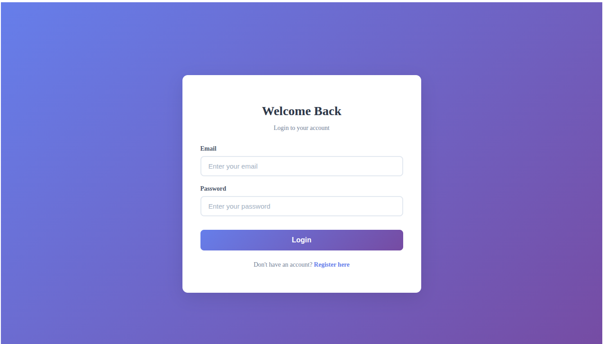
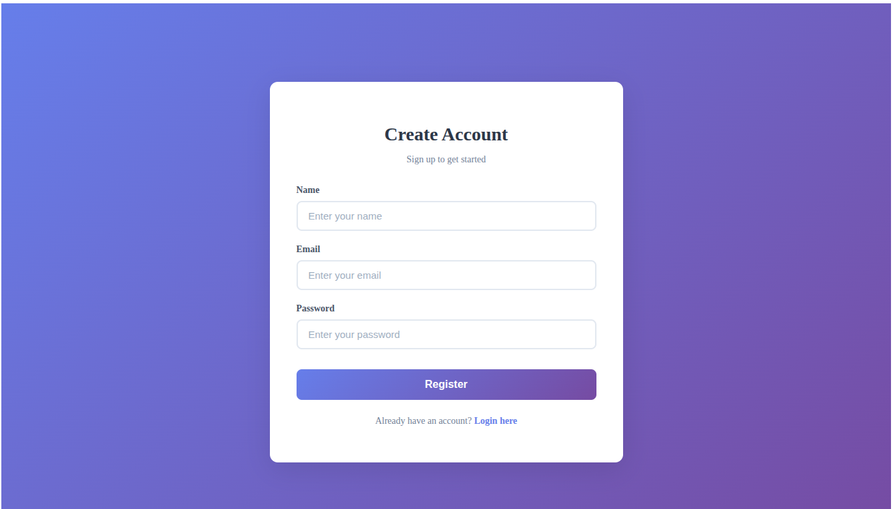
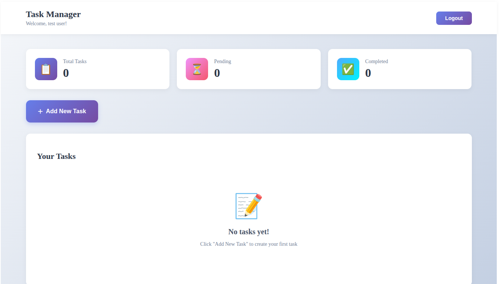

# Task Management Application

A full-stack Task Management web application that allows users to register, log in, and manage their personal tasks. Users can create, update, delete, and toggle tasks between pending and completed states.

---

## 🚀 Features

- User registration and login (JWT-based authentication)
- Create, read, update, and delete tasks
- Toggle task status (pending ↔ completed)
- User-specific task isolation
- Responsive and clean UI
- Secure backend with protected routes
- RESTful API design

---

## 🛠️ Tech Stack

### Frontend

- React(vite)
- Axios
- Context API
- CSS

### Backend

- Node.js
- Express.js
- MongoDB
- Mongoose
- JWT Authentication
- Passwords are securely hashed using bcrypt
- Express-rate-limit


### Tools

- Git & GitHub
- Nodemon
- Winston and morgan (logging)
- Postman (testing)

### 📂 Project Structure

#### Client

```bash
  client
├── eslint.config.js
├── index.html
├── package.json
├── package-lock.json
├── public
│   └── logo.svg
├── src
│   ├── api
│   │   └── axios.js
│   ├── App.jsx
│   ├── assets
│   ├── components
│   │   ├── AddTaskModal.css
│   │   ├── AddTaskModal.jsx
│   │   ├── TaskCard.css
│   │   └── TaskCard.jsx
│   ├── context
│   │   ├── AuthContext.jsx
│   │   └── TaskContext.jsx
│   ├── main.jsx
│   ├── pages
│   │   ├── Home.css
│   │   ├── Home.jsx
│   │   ├── Login.css
│   │   ├── Login.jsx
│   │   ├── Register.css
│   │   └── Register.jsx
│   └── routes
│       └── ProtectedRoute.jsx
└── vite.config.js
```

#### Server

```bash
  server
├── app.log
├── package.json
├── package-lock.json
└── src
    ├── app.js
    ├── controllers
    │   ├── healthCheck.controller.js
    │   ├── task.controller.js
    │   └── user.controller.js
    ├── db
    │   └── db.js
    ├── helpers.js
    ├── logger.js
    ├── middleware
    │   └── auth.middleware.js
    ├── models
    │   ├── task.model.js
    │   └── user.model.js
    ├── routes
    │   ├── healthCheck.routes.js
    │   ├── index.js
    │   ├── task.routes.js
    │   └── user.routes.js
    ├── server.js
    └── utils
        ├── ApiError.js
        ├── ApiResponse.js
        └── asyncHandler.js
```

### ⚙️ Environment Variables

Create a `.env` file in server directory

```bash
MONGODB_URI =
PORT = 5000

ACCESS_TOKEN_SECRET = your_jwt_secret_key
ACCESS_TOKEN_EXPIRY = 7d

FRONTEND_URL = *

NODE_ENV = development
```

### 🧑‍💻 Installation & Setup

1. Clone the repo

```bash
 git clone https://github.com/Mayank9056-MM/Task-Management-App
 cd Task-Management-App
```

2. Backend Setup

```bash
  cd server
  npm install
  npm run dev
```

3. Frontend Setup

```bash
  cd client
  npm install
  npm run dev
```

### 🔐 API Endpoints (Backend)

#### Authentication

| Method | Endpoint                 | Description       |
| ------ | ------------------------ | ----------------- |
| POST   | `/api/v1/users/register` | Register new user |
| POST   | `/api/v1/users/login`    | Login user        |

#### Tasks

| Method | Endpoint                   | Description        |
| ------ | -------------------------- | ------------------ |
| GET    | `/api/v1/tasks`            | Get user tasks     |
| POST   | `/api/v1/tasks`            | Create new task    |
| PATCH  | `/api/v1/tasks/:id`        | Update task        |
| PATCH  | `/api/v1/tasks/toggle/:id` | Toggle task status |
| DELETE | `/api/v1/tasks/:id`        | Delete task        |

> ⚠️ All task routes are protected and require a valid JWT access token in the Authorization header.

## 📄 License

> This project is for educational and skill assessment purposes.

## 🙋‍♂️ Author

> Mayank Mahajan
> Full Stack Developer

## 🖼️ Screenshots

### 🔐 Login Page


### 📝 Register Page


### 📋 Task Dashboard


### ➕ Add Task Modal

